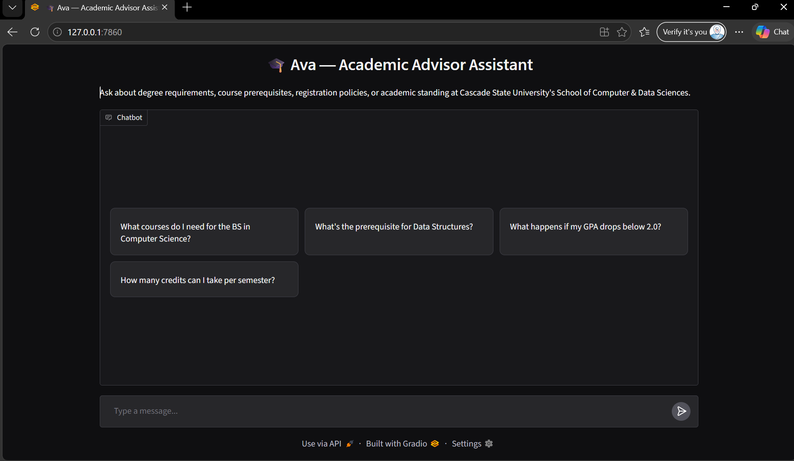
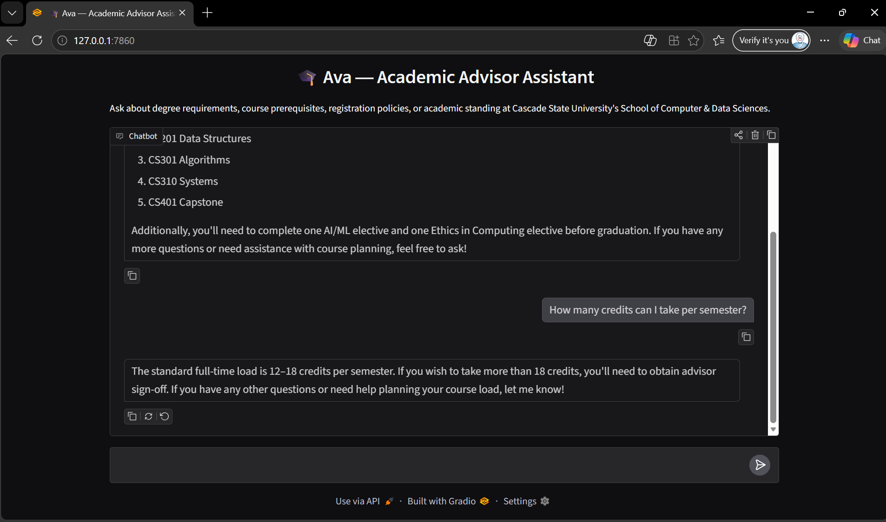

# 🎓 Academic Advisor Assistant

**AI Chatbot Development Using LLMs and Gradio**

This notebook builds a chatbot for a **real-time, practical use case**: an academic advisor
assistant for a university's School of Computer & Data Sciences. It uses Python programming language

## Use Case & Scope

**Persona:** Ava, the Academic Advisor Assistant for Cascade State University's School of
Computer & Data Sciences.

**What Ava can help with:**
- Degree requirements for the BS in Computer Science, BS in Data Science, and the AI minor
- Course prerequisites and recommended course sequencing
- Registration policies (credit load limits, add/drop/withdraw deadlines)
- Academic standing rules (GPA requirements, probation, holds)

**Out of scope (by design):** financial aid, medical/personal leave, disciplinary cases,
visa/international status, and anything not in the advising knowledge base below. For these,
Ava redirects the student to the human Advising Office rather than guessing.

**Workflow:**
1. Load a small text-based knowledge base of program/policy facts (`advisor_knowledge.txt`).
2. Fold that knowledge base into a system prompt that defines Ava's persona and boundaries.
3. Validate each user message before it reaches the model (reusable `validate_input` helper).
4. Send `system prompt + history + message` to the OpenAI Chat Completions API.
5. Serve the conversation through a Gradio `ChatInterface` with example prompts.

